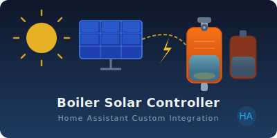

# Boiler Solar Controller — Home Assistant Custom Integration



Integrare personalizată pentru Home Assistant care controlează automat două boilere electrice pe baza surplusului de energie solară. Când panourile fotovoltaice produc mai mult decât consumi, integrarea pornește rezistențele boilerelor ca să folosești energia gratuită în loc să o injectezi în rețea.

---

## Cuprins

- [Cum e structurat codul](#structura-codului)
- [Cum funcționează](#cum-functioneaza)
- [Entități create](#entitati-create)
- [Instalare](#instalare)
- [Configurare (setup wizard)](#configurare)
- [Setări ajustabile din dashboard](#setari-ajustabile)
- [Teste](#teste)

---

## Structura codului

```
custom_components/boiler_ha/
├── __init__.py        — setup/teardown al config entry-ului, inițializează runtime store
├── config_flow.py     — wizard de configurare (3 pași) + options flow + reconfigure
├── const.py           — toate constantele: chei config, valori implicite, string-uri status
├── coordinator.py     — logica de control (DataUpdateCoordinator), polling + reactiv
├── number.py          — entități Number (slider/input) pentru setări ajustabile live
├── sensor.py          — entități Sensor: status text, temperatură, solar, rețea
├── switch.py          — entități Switch: „Control automat" per boiler
├── manifest.json      — metadata HACS/HA (domain, version, iot_class)
└── translations/
    ├── en.json        — etichete UI în engleză
    └── ro.json        — etichete UI în română
```

### `__init__.py` — Entry point

La `async_setup_entry` se inițializează un **runtime store** în `hass.data[DOMAIN][entry_id]` cu valorile din options (temperaturi maxime, prag surplus, putere rezistență). Acest store e un dict mutable în memorie — entitățile `number` și `switch` îl modifică direct fără a recrea config entry-ul.

Se instanțiază `BoilerCoordinator`, se face primul refresh, apoi se înregistrează platformele (`switch`, `number`, `sensor`).

La `async_unload_entry` se anulează subscripțiile de stare și se eliberează datele din `hass.data`.

### `coordinator.py` — Creierul integrației

`BoilerCoordinator` extinde `DataUpdateCoordinator` și rulează logica de control în două moduri:

1. **Polling** — la fiecare 30 de secunde
2. **Reactiv** — prin `async_track_state_change_event` pe senzori (solar, rețea, temperaturi); orice schimbare a unuia dintre acești senzori declanșează imediat un refresh

### `config_flow.py` — Wizard de configurare

Setup în 3 pași, plus options flow și reconfigure flow:

| Pas                   | Ce configurezi                                                                                                |
| --------------------- | ------------------------------------------------------------------------------------------------------------- |
| **Step 1 – user**     | Nume boiler, releu Shelly (switch), senzor temperatură, senzor consum real (opțional) — pentru fiecare boiler |
| **Step 2 – solar**    | Senzor producție solar, senzor rețea, convenția semnului senzorului de rețea, senzor tensiune (opțional)      |
| **Step 3 – settings** | Temperaturi maxime, prag minim surplus, putere nominală rezistențe                                            |

Options flow permite editarea setărilor din Step 3 fără a reinstala integrarea. Reconfigure flow permite schimbarea entităților (relee, senzori) fără a reinstala.

### `sensor.py`, `switch.py`, `number.py` — Entități HA

Toate entitățile extind `CoordinatorEntity` și se actualizează automat când coordinatorul publică date noi. Entitățile `switch` și `number` folosesc în plus `RestoreEntity` pentru a-și recupera ultima valoare după un restart al HA.

---

## Cum funcționează

### Calculul surplusului virtual

Valoarea centrală a logicii este **surplusul virtual** — câtă energie solară ar fi disponibilă dacă am opri boilerele:

```
surplus_virtual = export_retea
                + putere_boiler1  (dacă boilerul 1 e pornit)
                + putere_boiler2  (dacă boilerul 2 e pornit)
```

Senzorul de rețea poate raporta cu semn pozitiv fie importul, fie exportul — se configurează la setup prin opțiunea **convenție senzor rețea** și poate fi suprascrisă ulterior din options flow.

### Logica de decizie (per ciclu)

1. **Protecție la supraîncălzire — întotdeauna activă, indiferent de modul auto**
   - Dacă `temp >= max_temp` și releul e pornit → oprire imediată

2. **Control automat Boiler 1** (are prioritate față de B2)

   ```
   pornire  dacă: surplus_virtual >= prag_minim  ȘI  temp < max_temp  (sau sub prag histerezis)
   oprire   dacă: surplus_virtual < prag_minim  SAU  temp >= max_temp
   ```

3. **Control automat Boiler 2** (pornește doar dacă rămâne surplus după boilerul 1)

   ```
   surplus_ramas = surplus_virtual - putere_boiler1  (dacă B1 e pornit)
   pornire  dacă: surplus_ramas >= prag_minim  ȘI  temp2 < max_temp_2
   ```

4. Dacă modul **auto e dezactivat** pentru un boiler, releul lui nu e atins — controlul e manual.

### Tabel exhaustiv de decizii

| #    | Scenariu                                     | Releu inițial | Temperatură              | Surplus virtual                    |    Tensiune    |  Auto   | Rezultat                           |
| ---- | -------------------------------------------- | :-----------: | ------------------------ | ---------------------------------- | :------------: | :-----: | ---------------------------------- |
| S1   | Încălzire solară normală                     |      OFF      | < target − 5°C           | ≥ prag                             |     Normal     |   ON    | **Pornire**                        |
| S2a  | Surplus insuficient, releu OFF               |      OFF      | < target − 5°C           | < prag                             |     Normal     |   ON    | **Rămâne oprit**                   |
| S2b  | Surplus dispare în timp ce rulează¹          |      ON       | < target                 | virtual < prag                     |     Normal     |   ON    | **Oprire**                         |
| S3   | Protecție supraîncălzire                     |      ON       | ≥ target                 | orice                              |     orice      |  orice  | **Oprire imediată**                |
| S4   | Histerezis temp — în bandă, releu OFF        |      OFF      | target−5 ≤ temp < target | ≥ prag                             |     Normal     |   ON    | **Rămâne oprit**                   |
| S5   | Histerezis temp — sub prag, repornire        |      OFF      | < target − 5°C           | ≥ prag                             |     Normal     |   ON    | **Pornire**                        |
| S6   | Histerezis temp — releu ON în bandă          |      ON       | target−5 ≤ temp < target | ≥ prag                             |     Normal     |   ON    | **Continuă**                       |
| S7   | Prioritate temp scăzută (< 50% din target)   |      OFF      | < target × 50%           | < prag                             |     Normal     |   ON    | **Pornire forțată**                |
| S8   | Supratensiune — forțare pornire              |      OFF      | < target                 | < prag                             |     > 250V     |   ON    | **Pornire forțată**                |
| S9   | Supratensiune — boost target                 |       −       | ≥ target utilizator      | orice                              |     > 250V     |   ON    | Target +5°C, **pornire**           |
| S10  | Supratensiune — histerezis tensiune în bandă |       −       | < target                 | 245–250V                           | Activ anterior |   ON    | **Mod prioritate menținut**        |
| S11  | Supratensiune dispărută                      |       −       | orice                    | orice                              |     < 245V     |   ON    | Target restaurat                   |
| S12a | Control manual — boiler OFF                  |      OFF      | < target                 | ≥ prag                             |     Normal     | **OFF** | **Releu nemodificat**              |
| S12b | Control manual — boiler ON                   |      ON       | < target                 | < prag                             |     Normal     | **OFF** | **Releu nemodificat**              |
| S12c | Control manual — protecție activă            |      ON       | ≥ target                 | orice                              |     orice      | **OFF** | **Oprire** (protecția ignoră auto) |
| S13a | Senzor temp indisponibil, releu OFF          |      OFF      | N/A                      | orice                              |     orice      |   ON    | **Releu nemodificat**              |
| S13b | Senzor temp indisponibil, releu ON           |      ON       | N/A                      | orice                              |     orice      |   ON    | **Releu nemodificat**              |
| S14  | Boiler 2 — surplus insuficient după B1       |      OFF      | < target − 5°C           | suficient pt B1, insuficient pt B2 |     Normal     |   ON    | B1 pornit, **B2 oprit**            |
| S15  | Boiler 2 — surplus suficient după B1         |      OFF      | < target − 5°C           | suficient pt ambii                 |     Normal     |   ON    | **Ambii pornesc**                  |
| S16  | Balansare — B1 prea cald față de B2          |       −       | temp1 − temp2 > 5°C      | orice                              |     > 250V     |   ON    | **B1 ținut pe loc**, B2 pornit     |
| S17  | Balansare — B2 prea cald față de B1          |       −       | temp2 − temp1 > 5°C      | orice                              |     > 250V     |   ON    | B1 pornit, **B2 ținut pe loc**     |

> ¹ **Virtual surplus**: când B1 e pornit, `surplus_virtual = export_retea + putere_B1`. B1 se oprește abia când exportul e suficient de negativ încât `export_retea + putere_B1 < prag_minim`, adică rețeaua importă mai mult decât produce B1.

### De ce „surplus virtual"?

Dacă am folosi direct `export_retea`, un boiler pornit ar masca surplusul real — s-ar opri imediat după ce pornește. Surplusul virtual adaugă înapoi puterea boilerelor active, simulând situația „dacă le-aș opri". Astfel sistemul e stabil și reacționează corect când alți consumatori intră în priză.

---

## Entități create

| Entitate                             | Tip                  | Descriere                                                                                                               |
| ------------------------------------ | -------------------- | ----------------------------------------------------------------------------------------------------------------------- |
| `sensor.status_<boiler>`             | Sensor (text)        | Starea curentă: Încălzire / Standby / Temperatură atinsă / Fără producție solară / Control manual / Senzor indisponibil |
| `sensor.temperatura_<boiler>`        | Sensor (°C)          | Temperatura boilerului (oglindește senzorul configurat)                                                                 |
| `sensor.consum_<boiler>`             | Sensor (W)           | Consum curent: valoare reală din senzor (dacă e configurat) sau putere nominală × stare releu                           |
| `sensor.productie_solara`            | Sensor (W)           | Producția panourilor fotovoltaice                                                                                       |
| `sensor.putere_retea`                | Sensor (W)           | Putere rețea: pozitiv = import, negativ = export                                                                        |
| `switch.control_automat_<boiler>`    | Switch               | Activează/dezactivează controlul solar automat per boiler                                                               |
| `number.temperatura_maxima_<boiler>` | Number (°C, 30–95)   | Temperatura maximă țintă                                                                                                |
| `number.prag_minim_surplus_solar`    | Number (W, 0–10 000) | Surplusul minim necesar pentru a porni orice boiler                                                                     |
| `number.putere_nominala_<boiler>`    | Number (W, 0–10 000) | Puterea nominală a rezistenței (folosită în calculul surplusului virtual și ca fallback pentru consum)                  |

---

## Instalare

### Prin HACS

1. Adaugă repository-ul ca sursă personalizată în HACS → **Integrations**
2. Caută „Boiler Solar Controller" și instalează
3. Repornește Home Assistant

### Manual

```bash
cp -r custom_components/boiler_ha  <config_dir>/custom_components/
```

Repornește Home Assistant.

---

## Configurare

**Settings → Devices & Services → Add Integration → Boiler Solar Controller**

Urmează wizard-ul în 3 pași descris mai sus. După setup, integrarea apare ca un singur dispozitiv cu toate entitățile listate.

Setările pot fi modificate oricând din **Configure** fără a reinstala integrarea. Entitățile releu și senzori pot fi reasignate din **Reconfigure**.

---

## Setări ajustabile

Toate valorile de mai jos pot fi modificate live din dashboard (entitățile `number`) sau din **Configure** (options flow) fără restart:

| Setare                        | Implicit | Descriere                                                                                  |
| ----------------------------- | -------- | ------------------------------------------------------------------------------------------ |
| Temperatură maximă Boiler 1/2 | 90 °C    | Boilerul se oprește când atinge această temperatură                                        |
| Prag minim surplus solar      | 800 W    | Sub acest surplus, niciun boiler nu pornește                                               |
| Putere nominală Boiler 1/2    | 1500 W   | Puterea rezistenței, folosită în calculul surplusului virtual și ca fallback pentru consum |

> **Histerezis temperatură**: după atingerea temperaturii maxime, boilerul nu repornește decât când temperatura scade cu 5 °C sub țintă. Histerezisul e ignorat automat dacă targetul e modificat de user sau dacă e activă prioritatea de tensiune mare.

> **Histerezis tensiune**: modul prioritate se activează când tensiunea depășește 250 V și se dezactivează abia când scade sub 245 V. Banda de 5 V previne ciclarea rapidă on/off când boilerele pornite absorb curent și scad ușor tensiunea rețelei.

---

## Teste

Testele nu necesită o instalare completă de Home Assistant. Modulele HA sunt stub-uite automat prin `tests/conftest.py`.

### Rulare rapidă (recomandat — folosește `uv`)

```bash
uv run --with pytest --with pytest-asyncio python -m pytest tests/ -v
uv run --with pytest --with pytest-asyncio python -m pytest tests/ -q 2>&1 | tail -3 && git add -A && git commit -m "Release v1.1.9" && git tag v1.1.9 && git push origin main --tags
```

### Rulare cu un virtualenv existent

```bash
pip install -r requirements_test.txt
python -m pytest tests/ -v
```

### Structura testelor

```
tests/
  conftest.py              — stub-uri pentru modulele homeassistant
  test_control_logic.py    — logica de control (S1–S2, S7–S8, S12–S17)
  test_temp_hysteresis.py  — histerezis temperatură (S3–S6)
  test_voltage_boost.py    — boost target supratensiune + histerezis tensiune (S8–S11)
```

### Ce acoperă testele actuale

| Test                                                               | Scenariu | Comportament verificat                                                                       |
| ------------------------------------------------------------------ | :------: | -------------------------------------------------------------------------------------------- |
| `test_s1_normal_solar_heating_b1`                                  |    S1    | B1 pornește când surplus ≥ prag și temp sub target                                           |
| `test_s1_normal_solar_heating_b2`                                  |    S1    | B2 pornește când surplus acoperă ambii boileri                                               |
| `test_s2_insufficient_surplus_b1_stays_off`                        |   S2a    | B1 nu pornește când surplus < prag                                                           |
| `test_s2_insufficient_surplus_b1_turns_off`                        |   S2b    | B1 se oprește când virtual surplus scade sub prag                                            |
| `test_boiler_does_not_restart_just_below_target`                   |    S4    | Nu repornește la 1°C sub target (în bandă histerezis)                                        |
| `test_boiler_does_not_restart_at_exact_hysteresis_boundary`        |    S4    | Nu repornește exact la `target − 5°C` (strict `<`)                                           |
| `test_boiler_restarts_below_hysteresis_threshold`                  |    S5    | Repornește sub `target − 5°C`                                                                |
| `test_boiler_keeps_running_up_to_target_while_on`                  |    S6    | Releu ON în bandă — continuă fără oprire                                                     |
| `test_two_cycle_sequence_off_then_restart`                         | S3+S4+S5 | Ciclu complet: target → OFF → bandă → sub prag → repornire                                   |
| `test_s7_low_temp_priority_ignores_surplus`                        |    S7    | temp < 50% din target → pornire forțată fără surplus                                         |
| `test_s7_no_priority_when_temp_above_half_target`                  |    S7    | Fără prioritate când temp > 50% din target                                                   |
| `test_s8_overvoltage_forces_start_with_low_surplus`                |    S8    | Supratensiune → ambii boileri pornesc fără surplus                                           |
| `test_boost_activates_when_overvoltage_and_target_reached`         |    S9    | Target +5°C la supratensiune și temp atinsă                                                  |
| `test_boost_caps_at_default_max_temp`                              |    S9    | Target boostat nu depășește 90°C                                                             |
| `test_no_boost_when_temp_below_target`                             |    S9    | Fără boost dacă temp nu a atins targetul                                                     |
| `test_no_boost_when_voltage_normal`                                |    S9    | Fără boost la tensiune normală                                                               |
| `test_no_double_boost`                                             |    S9    | Al doilea ciclu sub supratensiune nu boostează din nou                                       |
| `test_restore_on_voltage_drop`                                     |   S11    | Target restaurat când tensiunea revine la normal                                             |
| `test_restore_uses_user_updated_target_during_boost`               |   S11    | Dacă userul schimbă targetul în timpul boost-ului, valoarea nouă e restaurată (nu cea veche) |
| `test_high_voltage_activates_above_threshold`                      |    S8    | Flag `high_voltage` activ la > 250V                                                          |
| `test_high_voltage_not_set_below_threshold`                        |    S8    | Flag inactiv sub 250V                                                                        |
| `test_high_voltage_stays_true_in_hysteresis_band`                  |   S10    | Rămâne activ în banda 245–250V                                                               |
| `test_high_voltage_clears_below_release_threshold`                 |   S10    | Dezactivare abia sub 245V                                                                    |
| `test_high_voltage_stays_false_in_hysteresis_band_when_not_active` |   S10    | Banda nu activează flag-ul de la zero                                                        |
| `test_boost_based_on_current_temp_not_user_target`                 |    S9    | Boost bazat pe temp curentă (nu pe target user) — fix inerție termică                        |
| `test_boost_re_raises_when_temp_exceeds_boosted_target`            |    S9    | Re-ridicare target dacă inerția termică depășește targetul boostat                           |
| `test_s12_auto_off_boiler_not_started`                             |   S12a   | Auto OFF → releu nemodificat (nu pornește)                                                   |
| `test_s12_auto_off_running_boiler_not_stopped`                     |   S12b   | Auto OFF → releu nemodificat (nu oprește)                                                    |
| `test_s12_temp_protection_still_fires_when_auto_off`               |   S12c   | Protecție supraîncălzire activă chiar și cu auto OFF                                         |
| `test_s13_sensor_unavailable_boiler_not_started`                   |   S13a   | Senzor indisponibil → releu OFF nemodificat                                                  |
| `test_s13_sensor_unavailable_running_boiler_not_stopped`           |   S13b   | Senzor indisponibil → releu ON nemodificat                                                   |
| `test_s14_b2_blocked_when_surplus_consumed_by_b1`                  |   S14    | B2 blocat când surplusul rămas după B1 e insuficient                                         |
| `test_s15_b2_starts_when_surplus_covers_both`                      |   S15    | B2 pornește când surplusul acoperă ambii boileri                                             |
| `test_s16_b1_held_back_when_too_hot_vs_b2`                         |   S16    | B1 ținut pe loc când e cu >5°C mai cald decât B2                                             |
| `test_s17_b2_held_back_when_too_hot_vs_b1`                         |   S17    | B2 ținut pe loc când e cu >5°C mai cald decât B1                                             |

---

## Release

### Pași pentru publicarea unui release nou

1. **Actualizează versiunea** în `custom_components/boiler_ha/manifest.json`:

   ```json
   "version": "1.x.y"
   ```

2. **Commit** modificările:

   ```bash
   git add .
   git commit -m "Release v1.x.y"
   ```

3. **Creează un tag Git** cu același număr de versiune:

   ```bash
   git tag v1.x.y
   git push origin main --tags
   ```

4. **Creează un GitHub Release**:
   - Mergi la repository → **Releases** → **Draft a new release**
   - Selectează tag-ul `v1.x.y` creat la pasul anterior
   - Titlu: `v1.x.y`
   - Descriere: copiază ce s-a schimbat (din jurnal)
   - Publică release-ul

5. **HACS** va detecta automat noul release după câteva minute. Utilizatorii cu integrarea instalată vor vedea notificarea de update în HA.

> **Notă**: HACS folosește tag-urile Git ca versiuni. Tag-ul trebuie să coincidă exact cu `version` din `manifest.json` (ex. ambele `1.2.0`, nu `v1.2.0` vs `1.2.0`).
